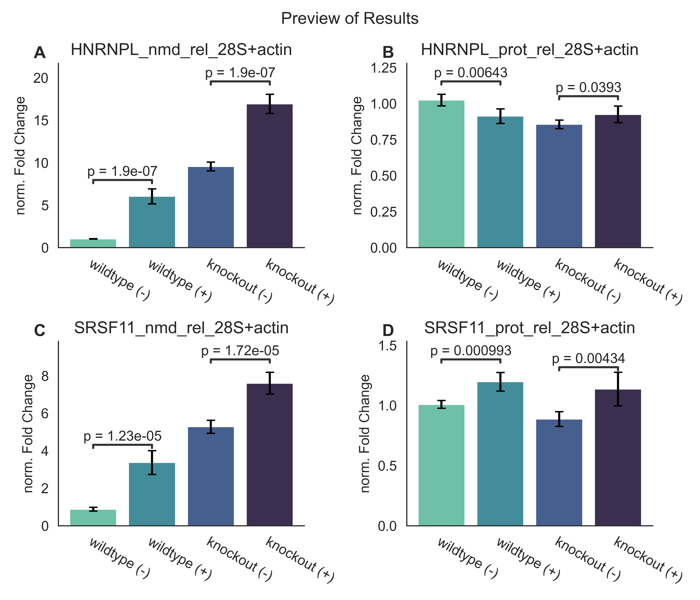

<!-- #  qpcr -->
<!-- #  qpcr -->

<p align="center">

</p>

---

### A python package to analyse qPCR data on single-datasets or high-throughput

[](https://zenodo.org/badge/latestdoi/398244987)
[](https://shields.io/)
[](https://badge.fury.io/py/qpcr)
[](https://www.codefactor.io/repository/github/noahhenrikkleinschmidt/qpcr)
[](http://qpcr.readthedocs.io/?badge=latest)
[](https://pepy.tech/project/qpcr)


This project presents a python package designed to facilitate the analysis of qPCR data through established `Delta-Delta-Ct` analysis. To that end, this module provides a set of processing classes that may be assembled into a fully-fledged analysis pipeline, starting from raw `Ct` values stored in `csv` or `excel` files all the way to finished visualisations of the results. 

User-friendliness and quick and easy workflows were of primary concern during development, so that this module is suitable for both non-experienced users as well as veteran coders. Virtually all steps within the analysis workflow are customizible to allow a streamlined analysis of any given dataset.

The exported results are formatted to be readily imported into other analysis or graphing software.

### Installation
This module can directly be installed via `pip`.

```
pip install qpcr
```
### Qupid Web App
In case you prefer a graphical user interface, `qpcr` offers the *Qupid* web app built with `streamlit`. Qupid provides access to the bulk of qpcr's main features with costumizability to some degree. Qupid is openly available [via streamlit](https://share.streamlit.io/noahhenrikkleinschmidt/qupid/main/src/main.py). Or can be run locally by cloning its [Github repository](https://github.com/NoahHenrikKleinschmidt/Qupid). 

### What does `qpcr` do?
The "core business" that `qpcr` was designed for is `Delta-Delta-Ct` analysis starting from raw Ct values. It offers automated processes to read datafiles, filter out outlier Ct values, compute Delta-Ct, normalise assays against one another, and visualise the results. Hence, `qpcr` offers a full suite for automated Delta-Delta-Ct analyses.
However, even if your analysis is not going to be Delta-Delta-Ct, you may wish to check out how the `qpcr.Readers` might help you faciliate your workflow, as they are streamlined to read diversely structured datafiles contianing both a single and multiple qPCR datasets. 

### Example usage
A very simple analysis may start from a single `excel` file containing data of several qPCR assays, some of which are "assays-of-interest" and some of which are "normalisers" such as 28S rRNA. If we have performed a tiny bit of pre-processing on our datafile, our analysis may look like this:

```python
import qpcr
from qpcr import stats as qstats

myfile = "todays_qPCR_run.xlsx"

# read the datafile
assays, normalisers = qpcr.read(myfile, multi_assay=True, decorator=True)

# we perform Delta-Delta Ct analysis
assays = qpcr.delta_ct(assays)
normalisers = qpcr.delta_ct(normalisers)

results = qpcr.normalise(assays, normalisers)

# at this point we can save our results to a file
results.save("./MyResults/")

# we can perform t-tests to compare the different groups (we can optionally select only specific pairs to compare)
qstats.assaywise_ttests(results, groups=[("wildtype (-)", "wildtype (+)"), ("knockout (-)", "knockout (+)")])

# and generate a preview that already includes the p-values of our t-tests
fig = results.preview()
```




### Getting started
For more information about the API, checkout the documentation on [Read the Docs](https://qpcr.readthedocs.io/en/latest/). There you will also find a number of basic tutorials. You can also access the tutorials direcctly as `jupyter notebooks` in the [Examples](https://github.com/NoahHenrikKleinschmidt/qpcr/tree/main/Examples) directory in this repository.

### Customisability
A technical note at this point. At it's core `qpcr` offers very versatile data manipulation through two processing classes called the `qpcr.Analyser` and the `qpcr.Normaliser`. The `qpcr.Analyser` performs actions on a single qPCR datasets / assay stored in a `qpcr.Assay` object (the central data storage unit of the `qpcr` module). 
It is used to perform `Delta-Ct` computation. However, the precise function that it _applies_ to the single Assay is customizable, so there is no restriction as such to what the Analyser will do to an Assay. 

On the other hand the `qpcr.Normaliser` will perform actions on a single Assay using data from a second Assay. It is used to perform normalisation of assays-of-interst against normaliser-assays. However, here too the precise function that is applied to the Assay is customizable.  


#### Citation
Kleinschmidt, N. (2023). qpcr - a python package for easy and versatile qPCR data analysis for small-scale datasets and high-throughput (Version 4.1.1) [Computer software]. https://github.com/NoahHenrikKleinschmidt/qpcr.git

