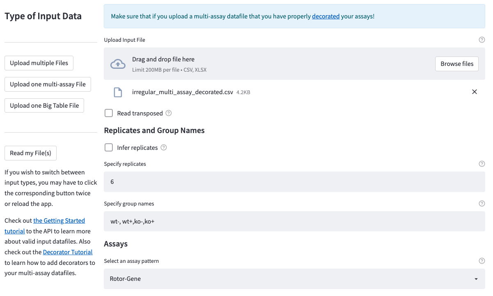

Welcome to ``qpcr``. This python package is designed for user friendly and easy analysis of qPCR data.
``qpcr`` offers a variety of methods to automate your qPCR data analysis and thus replace labour and time consuming Excel sessions with just a few lines of code.
Read on to learn about the basics of ``qpcr``. There are also a number of `tutorials on GitHub <https://github.com/NoahHenrikKleinschmidt/qpcr/tree/main/Examples>`_ to get you started.
It's really easy to use. And if you are not familiar with coding, you can also make use of the `Qupid Web App <https://share.streamlit.io/noahhenrikkleinschmidt/qupid/main/src/main.py>`_
that offers a very easy user interface for simple Delta-Delta-Ct analysis.

Terminology
===========

To begin with, we should first introduce some terminology. There are a number of important terms that you will meet when using the ``qpcr`` module that may feel unfamiliar when you think of "qPCR". 
Read on to learn what these terms mean and why they are important. 

``qpcr`` vs qPCR
----------------

Throughout this documentation, we will refer to the python package as ``qpcr`` in all lowercase, while we will talk about the qPCR experiment itself 
by using ``qPCR`` with uppercase. 

File (or "datafile")
--------------------

Let's start simple. A `file` is simply one of your input datafiles. For ``qpcr`` this means either a `csv` or an `excel` file. 
Files are the at the very basis of our data pipeline. 
However, ``qpcr`` does not strictly require that these files correspond to anything in particular from "qPCR vocabulary" *per se* 
(although the basic assumption underlying the default settings is that a single "regular" datafile contains exactly one single qPCR assay). 

The main ``qpcr`` classes are designed to work with datafiles that contain Ct values and replicate identifiers (see below for "replicates").
In the very most basic case, a simple datafile contains extactly one ``"id"`` or ``"Name"`` (or similar) column that identifies your measurements, 
and a ``"Ct"`` column that contains said measurements (can also be named differently). These columns together define *one qpcr dataset*. 

However, if your experimental setup looks differently, there are ways to adapt ``qpcr`` to handle different setups.
But if your data follows the above mentioned standard arrangements, you can think of a file as identical to a "qPCR assay".

"Regular" vs "irregular" datafiles
-----------

**Regular** datafiles only contain the ``id`` and ``Ct`` columns and nothing else, storing values of exactly one qPCR assay. 
**Irregular** datafiles also have to have these two columns, but they allow for more irregular stuff around these columns. 
Irregular files may contain multiple datasets (see below). Check out the documentation of the :ref:`qpcr.Parsers <Parsers>` and :ref:`qpcr.Readers <Readers>` for 
details on how to work with irregular and multi-assay datafiles.

A ``qpcr.Assay`` and a "dataset" / "assay"
------------------------------------------

Well, a "dataset" is simply a collection or replicate identifiers and corresponding Ct values belonging together. 
By default this usually corresponds to a single qPCR assay, hence you will often encounter the term "assay" used instead of "dataset" to be more 
intuitive. However, the two terms are really interchangeable. The ``qpcr.Assay`` class (capital A) is used to store the Ct values and replicate identifiers 
from a single dataset extracted from a datafile. Again, if your setup does not quite correspond to what you would call a "qPCR assay", don't worry about it.

Replicates
----------

As far as ``qpcr`` is concerned, each *row* within your datasets corresponds to one replicate measurement. 
Hence, a *replicate* is just a single pair of some identifier and a corresponding Ct value. 
That means that ``qpcr`` does not terminologically distinguish between multiplets (i.e. "true replicates" as an experimentor would understand them) and unicates. 
If you feel more comfortable with a term like "measurement" then you can also think of the replicates like that. 

Groups (of Replicates)
----------------------

This is one of the most important terms. In the previous paragraphs we already started to talk about replicates.  
Groups of replicates are, as their name already implies, well, a number of replicates that somehow do belong together.
For most cases, if your datafiles contain one assay each, then the groups of replicates are most likely your different qPCR samples / experimental conditions. 
We talk about *groups* of replicates instead of samples or conditions, primarily, because there might be different data setups so that these terms might not be always appropriate.
If your data follows default arrangements, however, then a *group of replicates* is just what you would think of as a "qPCR sample". 
Groups are assigned a numeric index starting from 0, which is how they are identified by the ``qpcr`` classes. 
However, they also come with a text label called the ``group_name`` (you can manually set and re-set the group names as you like). 
Many classes such as the ``qpcr.DataReader`` will actually just use the term ``names`` instead of the full ``group_names``. 
Whenever you see anything "names"-related it is (super-duper most likely) a reference to the ``group_names``.

Delta-Ct vs Delta-Delta-Ct vs normalisation
-------------------------------------------

The default analysis workflow in *Delta Delta Ct* analysis is to first calculate *Delta Ct* values using an intra-assay reference and then calculate the *normalised Delta Delta Ct* values from these using another "normaliser assay". 
The first step is performed by a class called ``qpcr.Analyser`` using its native method ``DeltaCt``. 
The second step is called `normalisation` and it is handled by a class called ``qpcr.Normaliser`` using its native method ``normalise``. Hence, ``qpcr`` is dedicated to performing Delta-Delta Ct analysis,
but the two steps in the computations are termed 1st: analyse, 2nd: normalise.

The "anchor" and the "reference group"
--------------------------------------

Next to the "groups of replicates", this is probably one of the most important terms. The **anchor** is simply the intra-dataset reference used by the ``qpcr.Analyser`` to compute *Delta Ct* values on a ``qpcr.Assay``. 
If your datafiles contain one assay each, and your groups of replicates are your qPCR samples, then you will likely have some "wildtype", "untreated", or "control" sample. 
Well, in ``qpcr`` terms that would be your **reference group**.
How do reference group and anchor differ? Usually your *anchor is part of or generated from the Ct values of your reference group* (like their ``mean`` for instance).
By default it is assumed that your reference group is the *very first* group of replicates. However, it's not a big problem if this is not the case, as you can specify different anchors easily.
So, again, the ``anchor`` is the dataset-internal reference value used to compute *Delta Ct* values.

"assays" vs "normalisers"
-------------------------

You will likely encounter methods and/or arguments that speak of "assays" and "normalisers", especially with the ``qpcr.Normaliser``. 
For all intents and purposes, an "assay" is simply one of your datasets (we know this already).
However, in practice "assays" are the short notation for specifically *"assays-of-interest"* 
(or more formally "datasets-of-interest"), while "normalisers" refer to your normaliser-assays (from housekeeping genes like ActinB for instance). 
But again, if your datafiles do not conform to standard data arrangements, do not be distracted from the terminology here.

You will also find that the term "assay" is used within the final results dataframe (when using the summary-statistics mode). 
In this setting "assay" refers to the assay-of-interst whose data was analysed according to the provided normaliser-assays. 
In fact, this is a new "hybrid" assay identifier that includes the names of all the normaliser-assays used during computation (check out what the final results look like and it'll be immediately clear).

"samples"
---------

You may find that there is also a term "sample" within ``qpcr``'s vocabulary. 
As far as the ``qpcr`` module is concerned, the term "sample" is not very important in itself and usually appears in the context of "sample assays".
In this setting it is used interchangeably with "assays-of-interest". 
Actually, we try to phase out the term "sample" and it currently mainly appears in hidden auxiliary functions which have retained the term from earlier development versions.

Some more Basics
================

Pipelines 
---------

A ``pipeline`` is essentially any workflow that starts from one or multiple input datafiles and ultimately pops out some results table you are happy with.
Pipelines can be manually created by assembling the main ``qpcr`` classes, usually starting with a Reader, passing to an Analyser, to an Normaliser, and you're good to go.
When manually assembling your workflow you can extract your data at any point and perform your own computations on it as you like. However, if you wish to "just do some good ol' Delta-Delta-Ct"
there are pre-defined pipelines that will handle writing the workflow and only require a very basic setup. You can find these in the :ref:`qpcr.Pipes <Pipes>` submodule.

``get``-ting your data
----------------------

Too many classes and objects? Well, no worries, the underlying data is stored as *pandas DataFrames*. To get your data from the clutches of the ``qpcr`` classes you can always use the ``get()`` method. 
``get`` is almost universal in the ``qpcr`` package, so whenever you want to extract your data, there is (most probably) a ``get()`` method to help you. However, many objects also support direct item getting and setting
so you may not have to extract your data in order to manipulate the underlying dataframes.

``link`` vs ``add`` vs ``pipe``
-------------------------------

Different classes have slightly different methods of adding data to them. Classes that only accept one single data input (such as a single ``qpcr.Assay`` object or a single filepath)
usually have a ``link()`` method that, well, links the data to them. After that the classes are ready to perform whatever actions they can perform.

Many classes such as the ``qpcr.Analyser`` have a wrapper that will call both their ``link()`` as well as their actual core-functional method together in one go. This wrapper is called ``pipe()``. 
So for the ``qpcr.Analyser`` you could either manually use ``link()`` and then ``DeltaCt()``, or simply call ``pipe()`` which does both for you. 
It is noteworthy that ``pipe`` methods actually *return* whatever their output is, which is *not* normally the case otherwise (normally you'd use the ``get()`` method to extract your data, see above). 
Also, ``pipe`` methods can accpet *lists of objects* as well as single objects and iterate over them automatically.
Most :ref:`qpcr.Readers <Readers>` and :ref:`qpcr.Parsers <Parsers>` are also equipped with ``pipe`` methods.

Now, what about ``add``?  Classes that accept multiple inputs have ``add`` methods, which tells the class where exactly to store the input data. 
``add``-methods are especially implemented within the pre-defined analysis pipelines of the :ref:`qpcr.Pipes <Pipes>` submodule. You will probably often use the methods ``add_assays()`` and ``add_normalisers()`` if you plan on using these predefined pipelines.
However, these classes usually still have a ``link()`` method somewhere that you can use as well. 
Also data-storing classes often have multiple ``add`` methods, each dedicated to adding specific types of data, such as the ``qpcr.Results.add_ddCt`` method that gets Delta-Delta-Ct values from a ``qpcr.Assay``.

Qupid
=====

In case you are not the type who likes to code, ``qpcr`` offers a grphical user interface in form of a Web App called **Qupid**. Qupid offers the main functionalities of ``qpcr`` but naturally lacks the full customizability that coding would offer.
However, it is easy to use and can save you a lot of time. The simplest analysis just requires some 4 Button clicks and about 40 seconds to finish (it's worth checking out!).
You can `access Qupid via Streamlit <https://noahhenrikkleinschmidt-qupid-srcmain-48pd7p.streamlit.app>`_. 
There is also a tutorial on how to use it `available here <https://github.com/NoahHenrikKleinschmidt/Qupid/blob/main/Tutorial.ipynb>`_.

