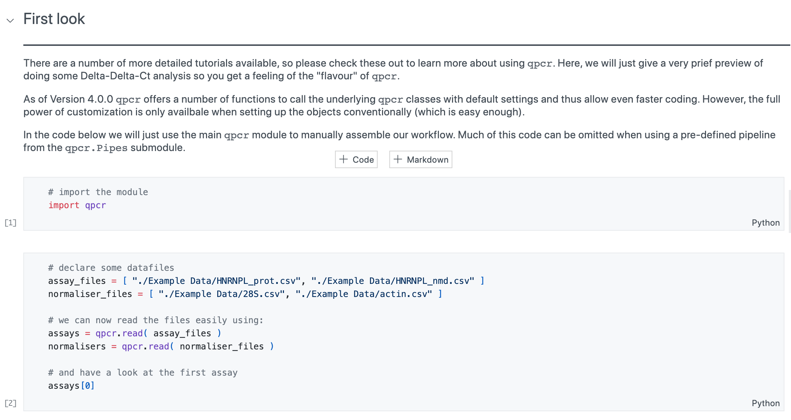

.. _tutorials:

Tutorials
=========

Here are a number of useful tutorials to help you get started. They are easy to follow along and explain not only the use of ``qpcr`` itself but also how to prepare your datafiles and more.

.. toctree::
	:maxdepth: 1
	:caption: Available tutorials
	
	tutorials/getting_started
	tutorials/manual_tutorial
	tutorials/pipeline_tutorial
	tutorials/filters
	tutorials/custom_anchor
	tutorials/customisable_piplines
	tutorials/irregular_files
	tutorials/big_table_files
	tutorials/decorating_datafiles
	tutorials/custom_efficiencies
	tutorials/statistical_tests